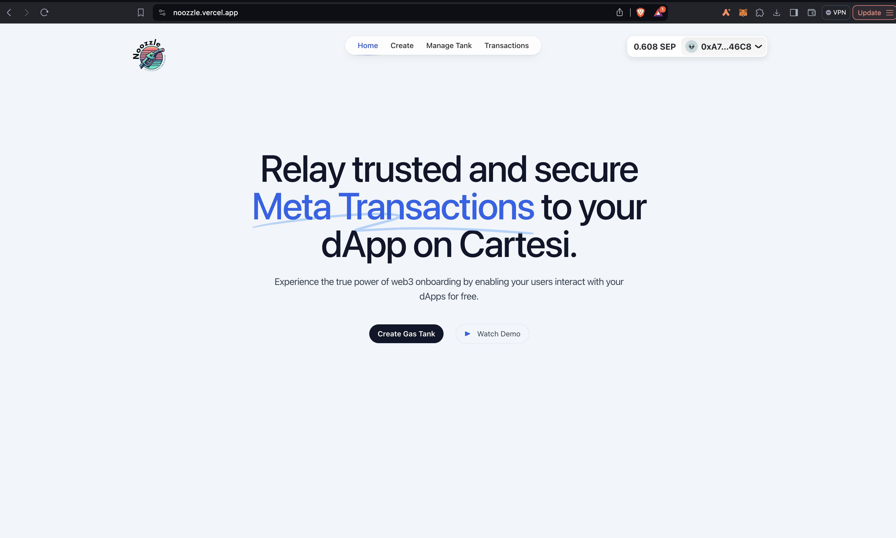
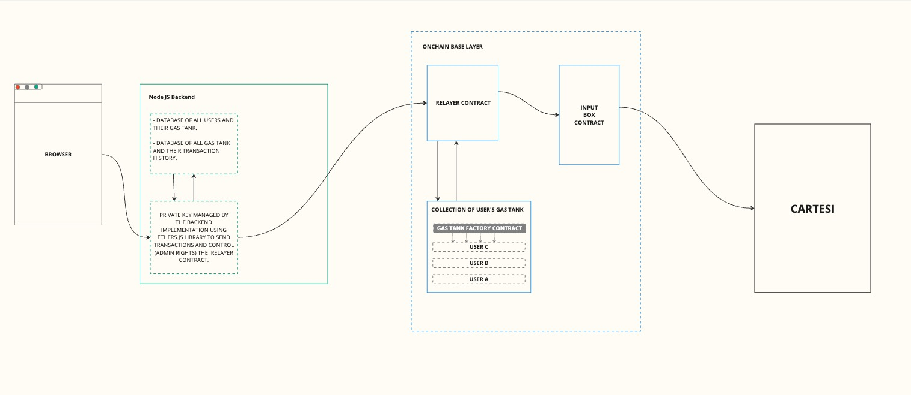
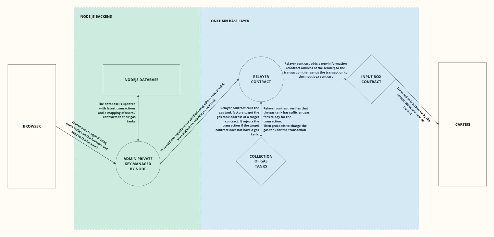
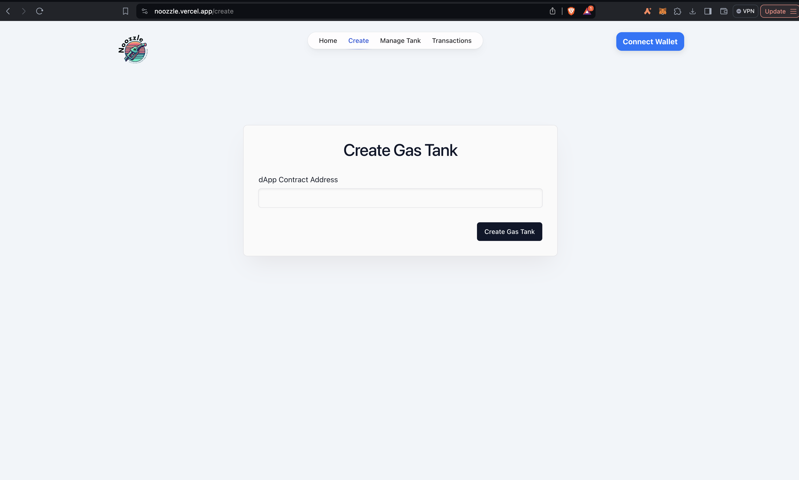
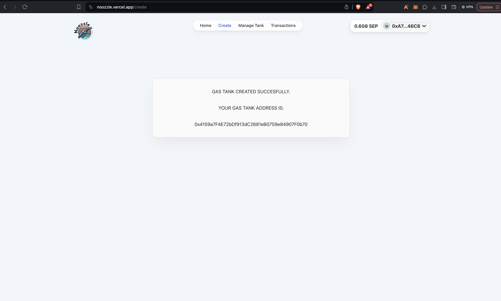
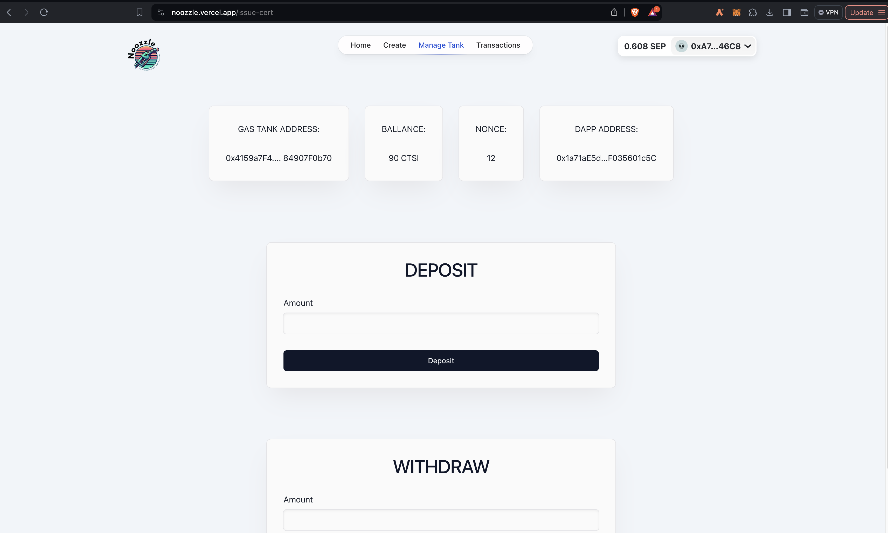
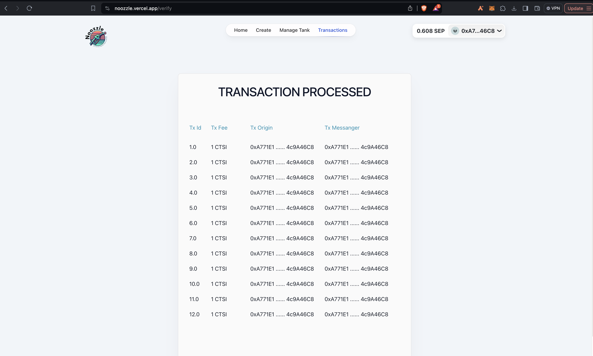

# Noozzle

Noozzle is a developer tool designed to serve as a framework for developers to onboard more users into their dApp by implementing gasless transactions (meta transactions) on their dApp. Noozzle achieves this by allowing developers to set up gas tanks which they fill themselves with CTSI tokens in order to cover the cost of gas fees for their users. Our framework enhances user experience and helps onboard more users not just to dApps or projects on Cartesi but to the Cartesi ecosystem as a whole.

## Architechture

## Testing
If you're interested in testing out the functionality of Noozule life please head over to [Noozule review](https://noozle-review.vercel.app/) and drop us a message at Zero gas cost. The rewiew frontend is connected to a cartesi dapp and allows you to interact with the dapp at zero gas cost throught the power of Noozule integration. 

We hope to better the user experience within the next couple days and also integrate more feautures.

## Key Components

Noozzle consists majorly of 3 components, all of which are structured into different folders and can be found at the root of this repository.
in addition to those 3 we also have a demo dapp folder which contains a demo dapp built on cartesi and aims to show the functionality of Noozule.
The major components are: 

### 1. NodeJs Backend
A robust backend to manage developers' gas tanks, track transaction histories, and handle transaction signatures using the ethersJs library.

### 2. Onchain Components (Solidity)
- **Gas Tank Factory**: A contract enabling developers to create and manage personalized gas tanks.
- **Gas Tank**: A developer-specific contract for funding and charging gas fees for user transactions.
- **Relayer Contract**: A base layer contract responsible for submitting user-signed transactions to the input box contract and charging the respective gas tank.

### 3. Cartesi Library
A minimal library for extracting user transaction data to facilitate seamless integration for developers.

## Features
- Enabling developers to implement gasless transactions in their projects (Implemented).
- Relaying random numbers from the Chainlink on the base layer to dApps on Cartesi (Proof of concept).

# Work  Flow
- Developer integrate out sdk into their frontend to send signed transactions to our relayer. Then also integrate out SDK on their backend to extract the message sender and signed transaction data.
-  Developer visits the relayer home page to create and func a gas tank.
-  While creating the gas tank you specify the address of your Cartesi dapp, so that information can be relayed to that address.
- After fcreation and funcing users can now interact with the developers dApp without needing to pay gas fees because the fees are now being charged from the develoeprs gas tank.

## Images:

## Getting Started

### Prerequisites
- Node.js
- NPM or Yarn
- Solidity compiler

### Contributing

We welcome contributions to enhance Noozzle. Please follow these steps to contribute:

1. Fork the repository.
2. Create a new branch: `git checkout -b feature-name`.
3. Make your changes and commit them: `git commit -m 'Add some feature'`.
4. Push to the branch: `git push origin feature-name`.
5. Create a pull request.

### License

This project is licensed under the MIT License - see the [LICENSE](LICENSE) file for details.

### Acknowledgements

We would like to thank the Cartesi community for their support and the Chainlink team for their reliable services.

---

Feel free to open an issue if you have any questions or need further assistance.

